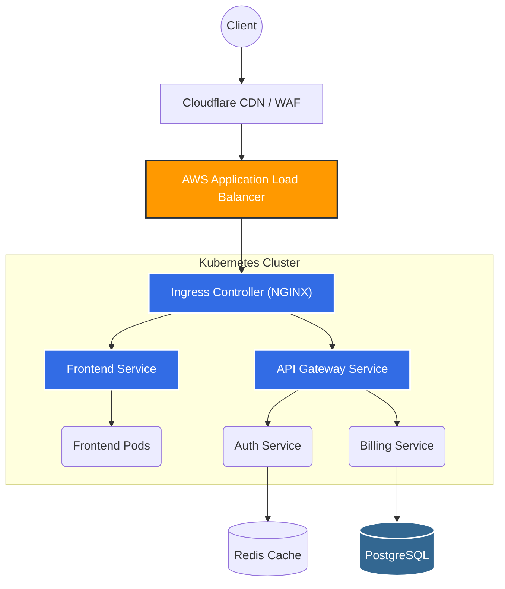

# Architecture & Standards

This section contains our standard operating procedures, architectural conventions, and naming standards to ensure consistency across the platform.

## Architecture

Below is a sample architecture representing how incoming traffic routes to our microservices via our standard API Gateway and Kubernetes Ingress.

## Naming Conventions

Consistency makes automation easier. Please adhere to the following when creating new resources:

### AWS Resources

Use the format: `<environment>-<region>-<service>-<name>`

*   **Example (S3):** `prod-euwest1-s3-applogs`
*   **Example (ALB):** `staging-useast1-alb-api`

### Kubernetes Namespaces

Namespaces should reflect the team or the primary generic function.

*   `monitoring` (Prometheus, Grafana)
*   `ingress-nginx` (Ingress controllers)
*   `team-billing`
*   `team-auth`

## GitOps Workflow

We practice GitOps. Direct cluster mutation via `kubectl apply` is disabled in `staging` and `prod`.

1.  Make a branch modifying the `k8s-manifests` repo.
2.  Open a Pull Request.
3.  CI runs `kubeval` and `conftest` policies.
4.  Once approved and merged to `main`, ArgoCD will automatically sync the changes.

## Terraform Best Practices

*   Never use local state. Always use the configured S3 backend with DynamoDB locking.
*   Pin module versions in the `main.tf` files.
*   Always run `terraform plan` and attach the output to the PR for review.
